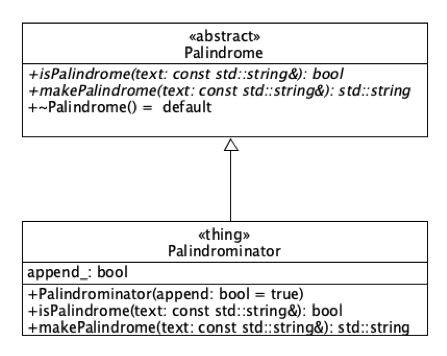

# Lab 08 - Using Stacks and Queues from the STL

In this lab we use the `std::stack<T>` and `std::queue<T>` from the STL to determine whether a string is a palindrome and to generate palindromes. The following UML diagram depicts the classes present in this project.

